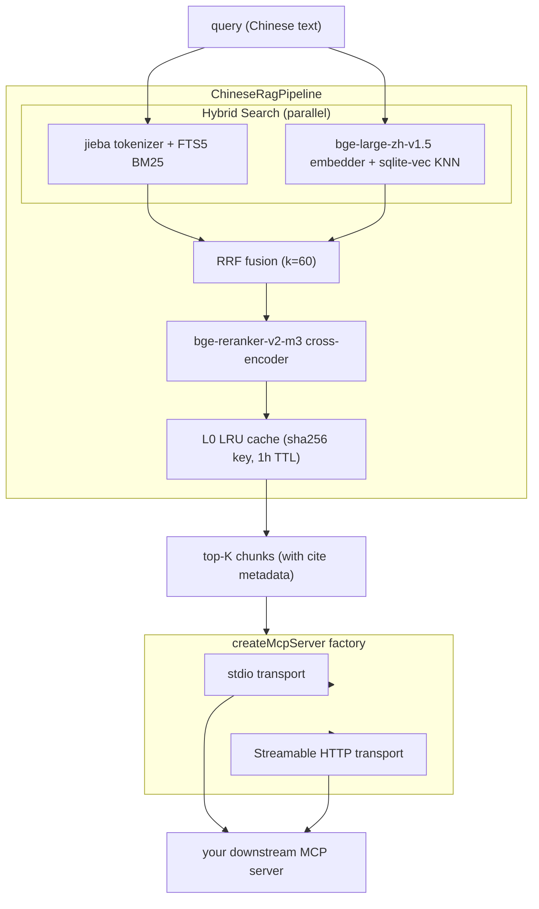

# @yiong/mcp-chinese-rag-toolkit

[](https://www.npmjs.com/package/@yiong/mcp-chinese-rag-toolkit)
[](https://www.npmjs.com/package/@yiong/mcp-chinese-rag-toolkit)
[](LICENSE)
[](https://github.com/yiongq/mcp-chinese-rag-toolkit/actions/workflows/ci.yml)
[](https://nodejs.org)

> Reusable MCP server factory + Chinese RAG pipeline + eval framework for building production MCP servers in TypeScript.

🚀 **v0.1.0 first public release.** Server factory + tool/resource builders + full Chinese RAG pipeline (FTS5+jieba / Hybrid Search RRF / BGE Reranker / Contextual Retrieval) all included.

## Architecture

A query flows through a hybrid retriever (BM25 + dense vectors fused by RRF), a cross-encoder reranker, and an L0 result cache — then `createMcpServer` exposes the whole thing over stdio **or** Streamable HTTP to whatever downstream MCP server you build:



Every box is a documented export — see the per-section API reference below.

## Performance & quality gates

The pipeline ships with measurable contracts rather than vibes:

| Gate | Threshold | Enforced by |
|---|---|---|
| Retrieval quality | `Hit Rate@5 ≥ 90%` / `MRR ≥ 0.80` | `rag-eval` CI job, blocking on every PR |
| stdio latency | `P95 < 200ms` per tool call | `runStdioLatencyHarness` bench — warn-not-block (`>50ms` drift); baseline committed after first `pnpm bench -- --write` |
| Embedding dim | `1024` (bge-large-zh-v1.5) | model manifest pin + SHA-256 attestation |

These are **framework-methodology** numbers measured against the toolkit's own 12-chunk self-eval fixture — a smoke test that the pipeline integrates end-to-end, not a domain benchmark. Each downstream package owns its real-data eval set; see [Eval Framework + RAG Eval CI Gate](#eval-framework--rag-eval-ci-gate) for the adapter pattern.

## Install

```bash
pnpm add @yiong/mcp-chinese-rag-toolkit
```

Requires Node.js `>=22.0.0`. Ships ESM + CJS + `.d.ts` / `.d.cts` so both `import` and `require` consumers (and TypeScript strict mode) resolve without dual-module hazard.

> **Behind a proxy?** On Node `>=22` the built-in `fetch` ignores `HTTPS_PROXY` unless you also set `NODE_USE_ENV_PROXY=1`. Set both when the first-run embedding / reranker model downloads must go through a proxy, otherwise the download hangs.

## Quick start

### stdio server (CLI / Claude Desktop / VS Code clients)

```ts
import { createMcpServer } from '@yiong/mcp-chinese-rag-toolkit';
import { z } from 'zod';

const server = createMcpServer({
  name: 'my-mcp', version: '0.1.0', transport: 'stdio',
  tools: [{
    name: 'ping',
    description: 'Reply with pong.',
    inputSchema: z.object({}),
    handler: async () => ({ content: [{ type: 'text', text: 'pong' }] }),
  }],
});
await server.start();
```

### Streamable HTTP server (remote MCP clients, stateless)

```ts
import { createMcpServer } from '@yiong/mcp-chinese-rag-toolkit';
import { z } from 'zod';

const server = createMcpServer({
  name: 'my-mcp', version: '0.1.0', transport: 'http', port: 3000,
  // Optional CORS whitelist. Omit to disable CORS entirely.
  // Each entry is matched by exact equality OR a scheme-anchored
  // `scheme://*` wildcard (e.g. `chrome-extension://*` matches any
  // extension id). The matched Origin is echoed back in
  // `Access-Control-Allow-Origin` (never a bare `*`), and `OPTIONS`
  // preflights are answered with 204 + the CORS headers.
  cors: { origins: ['chrome-extension://*'] },
  tools: [{
    name: 'echo',
    description: 'Echo the message.',
    inputSchema: z.object({ message: z.string() }),
    handler: async (args) => {
      const { message } = args as { message: string };
      return { content: [{ type: 'text', text: message }] };
    },
  }],
});
await server.start();
// POST http://127.0.0.1:3000/mcp
```

When `cors` is omitted no `Access-Control-*` headers are emitted and `OPTIONS` returns `405` (legacy no-CORS behaviour). CORS is a no-op for `transport: 'stdio'`.

### Error envelope

```ts
import { errors } from '@yiong/mcp-chinese-rag-toolkit';

return errors.create('ENTITY_NOT_FOUND', 'No matching record', {
  retryable: false,
  confidence: 'low',
  citations: [{ source: 'handbook.pdf', page: 12 }],
  refusal: 'No high-confidence answer available.',
});
```

The factory automatically wraps any thrown handler exception into an `INTERNAL_ERROR` envelope, so handlers never leak uncaught errors. Error codes are enforced `SCREAMING_SNAKE_CASE`; `retryable` defaults to `false` (fail-closed).

`MCP_TRANSPORT=stdio|http` env var is read when `config.transport` is omitted (default: `stdio`). Illegal values fail fast — no silent fallback.

## MCP Inspector smoke test

For an end-to-end protocol validation (Resources / Tools / Prompts primitives), run:

```bash
pnpm --filter @yiong/mcp-chinese-rag-toolkit exec \
  npx @modelcontextprotocol/inspector \
  pnpm --filter @yiong/mcp-chinese-rag-toolkit exec tsx scripts/inspector-smoke.ts
```

Then open the Inspector UI and verify all three tabs report ✅:

```
Resources: 0 ✓ / Tools: 1 (echo_tool) ✓ / Prompts: 0 ✓
```

## Tool Builder & Resource Provider

The `defineTool` / `defineResources` helpers enforce naming conventions (snake_case tool names,
camelCase parameter keys, `{scheme}://{kind}/{id}` resource URIs) at **build time**, and
`withHooks` reserves an opt-in instrumentation seam for future OpenTelemetry without touching
business code.

### `defineTool` — author-friendly + LLM-aware

```ts
import { defineTool, createMcpServer } from '@yiong/mcp-chinese-rag-toolkit';
import { z } from 'zod';

const echoTool = defineTool({
  name: 'echo_tool', // snake_case (build-time enforced)
  description: 'Echo the input message back to the caller.',
  whenToUse: 'For toolkit smoke testing only — verifies transport + factory wiring end-to-end.',
  examples: [
    { description: 'simple echo', input: { message: 'hello' } },
  ],
  inputSchema: z.object({
    message: z.string(), // camelCase (build-time enforced)
  }),
  handler: async ({ message }) => ({ content: [{ type: 'text', text: message }] }),
});

const server = createMcpServer({
  name: 'demo', version: '0.1.0', tools: [echoTool],
});
```

`description + whenToUse + examples` are composed into a single rich LLM-facing string and
capped at 2048 chars to keep the model's tool-selection context light. Bad names / bad
parameter keys / missing `whenToUse` / oversized descriptions throw at `defineTool` call
time — no surprises at runtime.

### `defineResources` — typed list / read with URI guardrails

```ts
import { defineResources, createMcpServer } from '@yiong/mcp-chinese-rag-toolkit';

const hrDocs = defineResources({
  uriScheme: 'hr', // ^[a-z][a-z0-9-]*$ (kebab/lower, build-time enforced)
  title: 'HR Documents',
  mimeType: 'text/markdown',
  list: async () => ({
    resources: [
      { uri: 'hr://page/23', name: 'Page 23' }, // {scheme}://{kind}/{id} — enforced
      { uri: 'hr://page/24', name: 'Page 24' },
    ],
  }),
  read: async (uri, { kind, id }) => ({
    contents: [{ uri: uri.href, text: `<page ${kind}/${id} content>`, mimeType: 'text/markdown' }],
  }),
});

const server = createMcpServer({
  name: 'hr', version: '0.1.0', resources: [hrDocs],
});
```

`createMcpServer` registers the resource via the MCP SDK's `ResourceTemplate` and fails fast
on duplicate `uriScheme` entries. Any `list()` entry or `read()` call whose URI breaks the
`{scheme}://{kind}/{id}` pattern throws before reaching the wire.

### `withHooks` — opt-in observability seam (future OTel pattern)

```ts
// Future pattern — pseudo-code, no runtime OTel dependency in this package.
import { defineTool, withHooks } from '@yiong/mcp-chinese-rag-toolkit';

const tool = defineTool({ /* ...as above... */ });
tool.handler = withHooks(
  tool.handler,
  {
    before: ({ toolName, args }) => span.start(toolName, { args }),
    after: ({ result, durationMs }) => span.end({ status: 'ok', durationMs }),
    error: ({ err, durationMs }) => span.recordException(err, { durationMs }),
  },
  { toolName: tool.name },
);
```

Invariants you can rely on:

- The original error is **re-thrown** — `createMcpServer` still owns conversion to the
  `INTERNAL_ERROR` envelope (no double-wrap, no lost stack trace).
- Hook failures are **swallowed** and logged via `console.warn`; business results never
  break because an observability hook misbehaved.
- `durationMs` uses `performance.now()` for high-precision, clock-jump-immune timing.

## Roadmap

| Capability | Surface added |
| --- | --- |
| ✅ Server factory + error envelope | `createMcpServer`, `errors` helpers |
| ✅ Tool builder + Resource provider + instrumentation hooks | `defineTool`, `defineResources`, `withHooks` |
| ✅ ADR + naming conventions migration | docs alignment, no API change |
| ✅ Chinese RAG pipeline (parser → chunk → embed → BM25 + vec + RRF + rerank) | `rag/*` exports + eval CI gate |
| ✅ Vision caption plugin | `rag/vision-caption` |
| ✅ `create-mcp-rag` CLI + Documentation Set | `bin/create-mcp-rag`, `docs/`, `templates/create-mcp-rag/` |

Each ✅ row maps to a shipped, tested slice of this public toolkit. Future directions are summarized in [What's next](#whats-next) below.

## What's next

Toolkit-scoped future directions (these are the open-source-relevant items; the full cross-package roadmap is tracked privately):

- **IndexingService / RAG-as-Service pivot** — a runtime document-upload + multi-tenant indexing seam so the toolkit can grow from an embedded library into a hosted service without a rewrite (the `IndexingService` interface is deliberately reserved for this).
- **WebGPU in-browser RAG** — run the embedder + reranker fully client-side via WebGPU, dropping the server round-trip for browser consumers.
- **Benchmark suite + industry comparison** — reproducible latency/quality benchmarks against Aider / Continue / Cursor-style retrieval stacks.
- **`mcp-codebase`** — a TreeSitter-based, code-aware sibling toolkit that reuses this Chinese RAG core for source-code retrieval.

## RAG primitives

The first slice of the Chinese RAG pipeline lands as pure primitives — PDF
text extraction and Markdown-aware chunking. They are the data-shape source
of truth (`Chunk` / `ChunkOptions` / `ParsePdfResult` / `PdfPage`) consumed
by every subsequent indexing / retrieval layer. The higher-level
`ChineseRagPipeline` (jieba + FTS5 + sqlite-vec + RRF + reranker) lands in
.

### `parsePdf` — PDF → per-page text (unpdf-based)

```ts
import { parsePdf } from '@yiong/mcp-chinese-rag-toolkit';

const { totalPages, pages } = await parsePdf('hr.pdf');
//                                            ^ string path | Uint8Array | ArrayBuffer
console.log(pages[0]?.pageNumber); // 1 — 1-indexed, matches Citation.page
console.log(pages[0]?.text);
```

`parsePdf` does NOT swallow underlying errors (corrupt PDF, missing file,
encrypted input). Callers wrap them into MCP envelopes via `errors.create`
when needed.

### `chunk` — Markdown hierarchical chunker

```ts
import { chunk } from '@yiong/mcp-chinese-rag-toolkit';

const chunks = await chunk(markdownText, {
  chunkSize: 1000,        // characters; default 1000, range [100, 4000]
  chunkOverlap: 200,      // characters; default 200, range [0, chunkSize)
  source: 'handbook.md',
});

chunks[0]?.section; // e.g. "第一章 入职流程 > 1.1 试用期" — H1..H4 path
```

Markdown headings up to four levels are tracked into `chunk.section`
(joined by ` > `). Chunks never span across a heading boundary; pure
text input leaves `section` undefined.

### `chunkPdfPages` — PDF → `Chunk[]` end-to-end

```ts
import { parsePdf, chunkPdfPages } from '@yiong/mcp-chinese-rag-toolkit';

const { pages } = await parsePdf('hr.pdf');
const chunks = await chunkPdfPages(pages, { source: 'hr.pdf' });
// every chunk carries source + page; blank pages are skipped.
```

Indexing (jieba tokenizer + FTS5 + `bge-large-zh-v1.5` embedder + `vec0`),
hybrid search, and reranking build on these primitives.

## RAG storage layer

The toolkit now ships an opinionated SQLite + `sqlite-vec` + jieba storage
layer that turns `Chunk[]` (from `chunkPdfPages` / `chunk`) into a single
`.db` file with three tables: `docs` (content + provenance), `docs_fts`
(FTS5 BM25 over jieba-pretokenized text) and `docs_vec` (`vec0` virtual
table holding the per-chunk embedding). Hybrid Search + RRF land in
— this section is the storage substrate they sit on.

### `openIndex` — open / create an index handle

```ts
import { openIndex } from '@yiong/mcp-chinese-rag-toolkit';

const handle = openIndex('data/hr-index.db', { embeddingDim: 1024 });
try {
  console.log(handle.getIndexVersion()); // → 'v1-…'
} finally {
  handle.close();
}
```

Pass `{ readonly: true }` to open a prebuilt `.db` (e.g. one shipped
inside an a downstream consumer package npm tarball) without re-running the schema.

### `indexChunks` — three-table transactional write

```ts
import { openIndex, parsePdf, chunkPdfPages } from '@yiong/mcp-chinese-rag-toolkit';

const handle = openIndex('data/hr-index.db');
const { pages } = await parsePdf('hr.pdf');
const chunks = await chunkPdfPages(pages, { source: 'hr.pdf' });
// `embedding` is a Float32Array of length `embeddingDim` (default 1024,
// matching bge-large-zh-v1.5 — will provide the embedder).
handle.indexChunks(chunks.map((chunk, i) => ({ chunk, embedding: embeddings[i] })));
handle.close();
```

Dimension mismatches fail fast and roll back the entire batch (single
`better-sqlite3` transaction — 50–100× faster than per-row autocommit).

### `ftsSearch` — BM25 over jieba-pretokenized text

```ts
const hits = handle.ftsSearch('请假流程', { topK: 30 });
hits[0]?.bm25Rank; // 1-indexed, ready for RRF fusion
```

### `vecSearch` — sqlite-vec KNN

```ts
const hits = handle.vecSearch(queryEmbedding, { topK: 30 });
hits[0]?.distance; // sqlite-vec L2 distance
```

### `tokenize` — standalone jieba pre-tokenization

```ts
import { tokenize } from '@yiong/mcp-chinese-rag-toolkit';
tokenize('试用期管理规定'); // → '试用期 管理 规定'
```

Exposed as a top-level helper so business code can reuse the same
tokenizer for query expansion / synonym lookup, not just indexing.

will land the `bge-large-zh-v1.5` embedder so `indexChunks`
can be driven from `chunk.content` end-to-end without external glue.

## Embedder

This section is the **semantic layer** of the Chinese RAG indexing
pipeline. It exposes `loadEmbedder()` (returns an `Embedder` whose
`embed` / `embedBatch` produce 1024-dim L2-normalized vectors via
`@huggingface/transformers` + `Xenova/bge-large-zh-v1.5`) and the
supply-chain guardrails (`verifyModelFiles` + a pinned
`BGE_LARGE_ZH_V1_5_MANIFEST`). Hybrid Search + RRF consume these
vectors.

### `loadEmbedder` — bge-large-zh-v1.5 (1024-dim, CLS pooling, L2-normalized)

```ts
import { loadEmbedder, openIndex, writeEmbedderMeta } from '@yiong/mcp-chinese-rag-toolkit';

const embedder = await loadEmbedder(); // default cacheDir = <userCacheDir>/mcp-chinese-rag-toolkit/models
const handle = openIndex(':memory:', { embeddingDim: 1024 });
writeEmbedderMeta(handle.db, embedder); // → meta.embedding_model = 'Xenova/bge-large-zh-v1.5'

const query = await embedder.embed('试用期多久'); // Float32Array(1024)
const batch = await embedder.embedBatch(['请假流程', '加班政策'], { batchSize: 32 });
```

`loadEmbedder` caches the underlying pipeline as a process-level singleton
keyed by the manifest content hash, cache dir, and load options
(`verifyHashes` / `allowRemoteModels`), so subsequent calls with the same
configuration return in <5 ms. Failed loads are evicted from the cache, so a
re-run after fixing a tampered file just works.

### `verifyModelFiles` + `ModelHashMismatchError` — supply-chain attestation

```ts
import {
  BGE_LARGE_ZH_V1_5_MANIFEST,
  ModelHashMismatchError,
  resolveCacheDir,
  verifyModelFiles,
} from '@yiong/mcp-chinese-rag-toolkit';

try {
  await verifyModelFiles(resolveCacheDir(), BGE_LARGE_ZH_V1_5_MANIFEST, { strict: true });
} catch (err) {
  if (err instanceof ModelHashMismatchError) {
    // CI / ops can run this as an independent attestation step before serving traffic.
  }
}
```

`loadEmbedder` runs the same verification twice automatically (pre-load
opportunistic + post-load strict). The standalone export exists so
operators can attest a pre-baked cache directory without instantiating
the pipeline. Catch with `err instanceof ModelHashMismatchError` OR
`err.name === 'ModelHashMismatchError'` — the latter survives the
ESM/CJS boundary should both copies of the package coexist.

### `BGE_LARGE_ZH_V1_5_MANIFEST` — pinned SHA-256 + byte size

The manifest is hardcoded; never fetched at runtime. To bump it for a
new upstream revision: run `pnpm manifest:fetch` (dev tool), paste the
output into `src/rag/model-manifest.ts`, run eval to confirm
no Hit Rate@5 regression, then ship as a toolkit minor bump.

## Hybrid Search

The retrieval layer composes the storage primitives and the
embedder into a single fused query: BM25 (`ftsSearch`) and
vector KNN (`vecSearch`) run in parallel, and Reciprocal Rank Fusion
(Cormack et al. 2009) merges the two ranked lists without normalizing
their disparate score scales. adds the
`bge-reranker-v2-m3` cross-encoder on top of the hybrid top-K; 
adds the LRU cache around the whole pipeline.

### `createHybridSearch` — BM25 + vec fused via RRF

```ts
import {
  createHybridSearch,
  loadEmbedder,
  openIndex,
  writeEmbedderMeta,
  writeTokenizerMeta,
} from '@yiong/mcp-chinese-rag-toolkit';

const embedder = await loadEmbedder();
const handle = openIndex('index.db', { embeddingDim: embedder.dim });
writeEmbedderMeta(handle.db, embedder); // → meta.embedding_model
writeTokenizerMeta(handle.db); // → meta.tokenizer_version = '@node-rs/jieba@2.0.1'

// (a downstream consumer package / a downstream consumer package build-index.ts owns the chunk → embedding → indexChunks loop.)

const search = createHybridSearch({ handle, embedder });
const hits = await search('试用期管理规定', { topK: 5 });
// hits[0]?.rrfScore  → ~0.03 (both BM25 and vec hit)
// hits[0]?.bm25Rank  → 1
// hits[0]?.vecRank   → 1 or 2
// hits[0]?.chunk.content → '试用期管理覆盖入职三个月内的所有同事…'
```

Defaults: `perSourceTopK = 30` (each side before fusion), `topK = 10`
(final fused cap), `rrfK = 60`. Pass `defaultOpts` to the factory to
share opts across calls, or override per-call. All three options accept
positive integers in `[1, 1000]` — out-of-range / non-integer / empty
query inputs throw fail-fast `Error('hybridSearch: …')`. Errors from
`embedder.embed` / `handle.ftsSearch` / `handle.vecSearch` propagate to
the caller unmodified; `wrapHandler` (server layer) is the canonical
spot to convert them into MCP error envelopes.

### `rrfFuse` — pure rank-fusion helper

```ts
import { rrfFuse } from '@yiong/mcp-chinese-rag-toolkit';

const bm25 = [{ id: 1, rank: 1, payload: 'a' }, { id: 2, rank: 2, payload: 'b' }];
const vec = [{ id: 2, rank: 1, payload: 'B' }, { id: 3, rank: 2, payload: 'C' }];
const fused = rrfFuse([bm25, vec], { k: 60 });
// fused[0] → { id: 2, score: 1/61 + 1/62, ranks: [2, 1], payloads: ['b', 'B'] }
```

`rrfFuse` is the same fusion `createHybridSearch` uses internally —
exposed standalone so the reranker can fuse its own third
ranked list (`rrfFuse([fts, vec, rerank], { k: 60 })`) and so third-party
toolkit consumers can test alternative fusion strategies against the RRF
baseline.

### `writeTokenizerMeta` + `JIEBA_VERSION` — pin the active jieba release

```ts
import { JIEBA_VERSION, writeTokenizerMeta } from '@yiong/mcp-chinese-rag-toolkit';

writeTokenizerMeta(handle.db); // defaults to JIEBA_VERSION ('@node-rs/jieba@2.0.1')
// SELECT value FROM meta WHERE key = 'tokenizer_version' → '@node-rs/jieba@2.0.1'
```

Symmetric to `writeEmbedderMeta`: call once during indexing to pin the
jieba release into the on-disk index. 's cache key and any
future jieba-dictionary upgrade trigger a reindex decision based on this
field; upgrading the dep without bumping `JIEBA_VERSION` is a
correctness bug.

## Reranker

The reranker stage is the *last* stop in the RAG retrieval pipeline
(`hybrid → rerank → optional LRU cache`). It runs the
`bge-reranker-v2-m3` cross-encoder over `(query, chunk.content)` pairs
to produce a sigmoid-of-logit relevance score in `[0, 1]` and trims the
hybrid top-10 down to the canonical top-5 envelope used by
`a downstream consumer package.search_hr_docs` and `a downstream consumer package.*`. The LRU cache,
when it lands, wraps the entire `hybrid + rerank` pipeline as a single
`withLruCache` middleware — the reranker is intentionally a separate
factory so callers can skip it (ablation eval) or share its cache.

This section is also the home of  (`stdio P95 < 200ms`): the
`runStdioLatencyHarness` + `bin/latency-harness.ts` harness measures P95 and,
once a `bench/baseline.json` is committed, warns on `>50ms` drift (warn-not-block;
the baseline is generated on first `pnpm bench -- --write`, see below).

### `loadReranker` + `Reranker.rank`

```ts
import { loadReranker } from '@yiong/mcp-chinese-rag-toolkit';

const reranker = await loadReranker();
const scores = await reranker.rank('试用期', [
  '试用期管理覆盖入职三个月内的所有同事。',
  '加班补偿可换算调休。',
  '请假流程通过 OA 提交。',
]);
// scores[0]?.score → ~0.95 (exact relevance — cross-encoder is much
//                            sharper than the bi-encoder embedder)
// scores[1]?.score → ~0.05
```

`loadReranker(opts?)` returns a process-wide singleton keyed by
`(manifestFingerprint, cacheDir, verifyHashes, allowRemoteModels)` —
mirroring `loadEmbedder`. The default manifest pins
`onnx-community/bge-reranker-v2-m3-ONNX` at `dtype: 'q8'` (570MB
single-file ONNX; see manifest JSDoc for the trade-off rationale).
`rank(query, documents, opts?)` clamps `batchSize` to `[1, 64]` and
`maxLength` to `[16, 512]`; `documents` order is preserved in the
result so callers can re-attach their own metadata via the
`RankedDocument.index` field.

### `createReranker` + `RerankedHit`

```ts
import {
  createHybridSearch,
  createReranker,
  loadEmbedder,
  loadReranker,
  openIndex,
} from '@yiong/mcp-chinese-rag-toolkit';

const embedder = await loadEmbedder();
const reranker = await loadReranker();
const handle = openIndex('index.db', { embeddingDim: embedder.dim });

const search = createHybridSearch({ handle, embedder });
const rerank = createReranker({ reranker, defaultOpts: { topK: 5 } });

const hybrid = await search('试用期管理规定', { topK: 10 });
const reranked = await rerank('试用期管理规定', hybrid);
// reranked[0]?.rerankScore → ~0.95 (sigmoid(logit))
// reranked[0]?.chunk.content → '试用期管理覆盖入职三个月内的所有同事…'
// reranked[0]?.rrfScore     → preserved from hybrid
// reranked[0]?.bm25Rank     → preserved
```

`RerankedHit extends HybridHit` — every hybrid metric (RRF score, BM25
rank, vec distance) is preserved so tool handlers can build the 
`metric breakdown` envelope without re-querying. Output is sorted by
`rerankScore` descending; ties break on `docId` ascending (
symbol comparison). `topK` accepts `Infinity` for "return every
reranked candidate" — matching `createHybridSearch`'s contract.

The  /  `confidence: 'low'` threshold (default `< 0.5`) is
the tool handler's responsibility; the toolkit
exposes `rerankScore` raw.

### `writeRerankerMeta` + `BGE_RERANKER_V2_M3_MANIFEST`

```ts
import {
  BGE_RERANKER_V2_M3_MANIFEST,
  writeRerankerMeta,
} from '@yiong/mcp-chinese-rag-toolkit';

writeRerankerMeta(handle.db, reranker);
// SELECT value FROM meta WHERE key = 'reranker_model'
//   → 'onnx-community/bge-reranker-v2-m3-ONNX'
```

Symmetric to `writeEmbedderMeta` / `writeTokenizerMeta`: pins the
reranker modelId into the on-disk index for provenance / debug.
**Intentionally NOT part of the cache key** — swapping the
reranker does not invalidate the FTS / vec stores, so the cache key
stays `(toolName, indexVersion, args)`.

`BGE_RERANKER_V2_M3_MANIFEST` is the supply-chain pin — same "edit
the literal, never automate the refresh, run eval before
bumping" discipline as `BGE_LARGE_ZH_V1_5_MANIFEST`.

### `runStdioLatencyHarness` + `bench/baseline.json`

```bash
pnpm bench                       # measure + diff against bench/baseline.json
pnpm bench -- --write            # overwrite baseline.json (PR-reviewed!)
pnpm bench -- --measure-runs 200 # override sample size (default 100)
```

The CLI wires `loadEmbedder + loadReranker + createHybridSearch +
createReranker` over an in-memory 12-chunk HR fixture, then runs
5 warmup + 100 measured tool calls through an in-process MCP server
pair (`InMemoryTransport.createLinkedPair()`). The resulting snapshot
includes P50/P95/P99 + cold-start + a full environment fingerprint
(`node` / `platform` / `arch` / toolkit + model + jieba versions).

`bench/baseline.json` is the contract file `pnpm bench` diffs against —
generated on the first run via `pnpm bench -- --write` and committed once
reviewed (it is not pre-committed in the repo today). Once present, `pnpm bench`
warns on `> 50ms` P95 drift, and the GitHub Actions bench job emits a
`::warning::` annotation on regressed PRs (warn-not-block in the MVP;
a future release may flip to block). `bench/latest.json` is gitignored
per-run output for CI artifact upload and local diffing.
Cross-platform baselines are NOT comparable (CI Linux x64 vs local
macOS arm64 will skip the numeric diff and print `⚠️ env drift`
instead).

wraps the full `hybrid + rerank` pipeline in an LRU
cache (`withLruCache`); cache hits collapse the entire reranker
forward pass + hybrid query to a single dict lookup, knocking p50 down
to ~0ms for warm queries. See §L0 Tool-Result Cache below. 
then layers the eval framework on top to enforce `Hit Rate@5 ≥ 90%` as
a CI gate.

## L0 Tool-Result Cache

`withLruCache(toolName, handler, opts)` wraps an MCP tool handler with a
per-server in-memory LRU. The cache is **L0** — the *whole*
`CallToolResult` envelope is keyed by `(toolName, indexVersion,
canonicalize(args))`, so cache hits collapse the entire RAG pipeline
(hybrid query + rerank + zod parse + JSON-RPC encode) to a single map
lookup (~1µs path; tests assert end-to-end `< 5ms` over the in-process
transport pair). One cache, one layer — MVP deliberately skips L1+
(query-embedding cache, candidate-chunk cache, rerank-score cache);
benchmark first, layer second.

### Manual wrapping

```ts
import { withLruCache } from '@yiong/mcp-chinese-rag-toolkit';

const cachedSearch = withLruCache('search_hr_docs', rawSearchHandler, {
  indexVersion: handle.getIndexVersion(),
  max: 500,                  // default 500
  ttlMs: 60 * 60 * 1000,     // default 1 hour
});
```

### One-line wiring via `createMcpServer`

```ts
import {
  createMcpServer,
  loadEmbedder,
  loadReranker,
  openIndex,
} from '@yiong/mcp-chinese-rag-toolkit';

const handle = openIndex('./data/hr-index.db', { readonly: true });

const server = createMcpServer({
  name: 'a downstream consumer package',
  version: '0.1.0',
  tools: [searchHrDocs],
  cache: { indexVersion: handle.getIndexVersion() }, // 500 entries / 1h TTL defaults
});

await server.start();
```

Omit `cache` (or pass `cache: { enabled: false, indexVersion: '…' }`) to
disable. Passing `cache: {}` without an `indexVersion` emits a single
`console.warn` and falls back to cache-off (walking-skeleton
parity).

### Cache-bypass conditions

| Trigger | Behaviour |
|---|---|
| `result.isError === true` | Never written (re-running may succeed; would lock user out of recovery) |
| `result.structuredContent.confidence === 'low'` | Never written (dynamic state — eval threshold tuning, fixture churn) |
| `args.env` present and `!== 'dev'` (e.g. `'prod'` / `'test'`) | Never written (mutate-style hints; caller explicit opt-out) |
| `args.env === 'dev'` or missing | Normal cache behaviour |

`NON_CACHEABLE_ARGS = new Set<string>(['env'])` is the **blacklist**;
future additions (`'dryRun'`, `'force'`, …) APPEND ONLY to keep the
contract stable.

### `_meta.cache` field

Every result that passes through `withLruCache` has
`structuredContent._meta.cache: 'hit' | 'miss'` injected on the read
path. Always present (not conditionally written) so eval / OTel /
Inspector can rely on a binary contract instead of a truthy-or-missing
check. The `_meta` namespace (underscore prefix) avoids collision with
business fields.

### Cache invalidation paths

| Trigger | Behaviour |
|---|---|
| Rebuild index (`rm db && openIndex({ indexVersion: 'v2-…' })`) | New `indexVersion` produces new SHA-256 keys; old entries become unreachable + age out via TTL |
| MCP server process restart (stdio per-session) | In-memory LRU disappears with the process |
| Per-entry TTL expiry (1 h default) | `lru-cache@^11` lazy eviction on next get |
| LRU capacity limit (500 default) | Built-in least-recently-used eviction |
| Explicit `cache.clear()` admin tool | **Not supported** — a future design pass alongside OTel |

### Anti-patterns

- ❌ Persisting the cache to SQLite — invalidation complexity ≫ benefit
- ❌ Semantic-similarity hit ("请假怎么申请" ≡ "如何请假") — embeddings are
  not free + drift across model versions
- ❌ Stacking L1+ caches without benchmark data — MVP keeps one layer
- ❌ Caching `isError` envelopes — would freeze recovery for the user
- ❌ HTTP transport caching: the current `connectStreamableHttp`
  rebuilds the server per request → cache is effectively no-op on HTTP.
  **stdio path is fully effective**; re-evaluates if
  HTTP consumers report 100% miss rate.

## Contextual Retrieval

 wires Anthropic's [Contextual Retrieval](https://www.anthropic.com/news/contextual-retrieval)
(2024-09 release; ~35% Hit Rate improvement reported when combined
with BM25 + Reranker) into the toolkit's indexing path. The full
source document is sent once with `cache_control: { type: 'ephemeral'
}`; subsequent chunks reuse the cached prefix so token cost stays
≤ 50% vs uncached.

### Generate prefixes during indexing

```ts
import {
  generateChunkContext,
  stitchPrefixedChunk,
  type LlmProvider,
} from '@yiong/mcp-chinese-rag-toolkit';

// Caller-side: instantiate the SDK; toolkit deliberately does NOT
// depend on @anthropic-ai/sdk so callers stay free to swap providers.
// import Anthropic from '@anthropic-ai/sdk';
// const client = new Anthropic();
//
// const anthropicProvider: LlmProvider = {
//   async generateChunkPrefix({ fullDocument, chunkContent, cacheKey, prefixLength }) {
//     const message = await client.messages.create({
//       model: 'claude-haiku-4-5-20251001', // index-time cost-sensitive
//       max_tokens: prefixLength.max + 20,   // buffer for truncation safety
//       system: [
//         {
//           type: 'text',
//           text: fullDocument,
//           cache_control: { type: 'ephemeral', ttl: '1h' }, // ★ cache the doc
//         },
//         {
//           type: 'text',
//           text: `生成 ${prefixLength.min}-${prefixLength.max} 字的上下文 prefix`,
//         },
//       ],
//       messages: [{ role: 'user', content: `片段：${chunkContent}\n\n直接输出 prefix：` }],
//     });
//     const block = message.content[0];
//     return block.type === 'text' ? block.text : '';
//   },
// };

for (const chunk of chunks) {
  const prefix = await generateChunkContext(
    chunk,
    { fullDocument, cacheKey: docSha256 }, // ★ same cacheKey for the whole doc
    anthropicProvider,
  );
  const prefixedChunk = stitchPrefixedChunk(chunk, prefix);
  await handle.indexChunks([
    { chunk: prefixedChunk, embedding: await embedder.embed(prefixedChunk.content) },
  ]);
}
```

### `cacheKey` is contract

The caller MUST pass the same `cacheKey` for every chunk of one source
document — otherwise the provider sees N independent requests and
charges full token cost on each. Recommended:
`cacheKey = path.basename(source) + ':' + contentSha256` (stable
across CI re-runs).

### Where `stitchPrefixedChunk` belongs in the pipeline

```
parse → chunk → generateChunkContext → stitchPrefixedChunk → embedder.embed → indexChunks
                                       ▲
                                       └── BEFORE embed/index so the prefix
                                           participates in BOTH BM25 tokenization
                                           AND the dense vector
```

### a downstream consumer package / a downstream consumer package integration

`a downstream consumer package` `build-index.ts` is the first real consumer.
The toolkit only provides the prompt template + provider abstraction
+ stitching helpers; SDK selection, API key handling, and per-doc
sha256 computation happen caller-side (architecture §AI Agent 强制规则
#4 — API keys never enter the toolkit).

### Out of scope here

- Real LLM end-to-end token-reduction validation (a downstream consumer package verifies
  in real `client.messages.create` `cache_read_input_tokens` /
  `cache_creation_input_tokens` fields)
- RAG Hit Rate@K evaluation framework
- Vision-caption plugin for PDFs with images

**Related:** the eval framework enforces
`Hit Rate@5 ≥ 90%` as a CI gate; a downstream consumer package wires this Contextual
Retrieval + L0 cache pair into a real HR Q&A end-to-end demo.

## Eval Framework + RAG Eval CI Gate

lands the **eval framework** + **`rag-eval` CI gate** that enforces
`Hit Rate@5 ≥ 90%` on every PR — *before* a downstream consumer package ships, so the
RAG pipeline parameters (chunking / RRF constants / reranker / embedder /
contextual retrieval) are locked-in by a measurable contract rather than vibe.

The eval framework covers :
- **** YAML-declared eval set with reason comments (``)
- **** Hit Rate@K + MRR aggregate metrics
- **** CI exit-code 1 when `Hit Rate@5 < 90%` (blocking, not warn)
- **** GitHub Actions artifact: `summary.json` + `report.md` + `per-query.json`
- **** per-query metric breakdown (`rerankScore` / `distance` / `ftsRank`)

The 90% baseline mirrors Anthropic's
[Contextual Retrieval blog (Sep 2024)](https://www.anthropic.com/news/contextual-retrieval)
industry numbers for Chinese RAG (BM25 + reranker stack lands around 88-93%);
toolkit fixture is engineered to land well above, so any regression points at a
real pipeline change rather than a noisy bar.

### YAML eval set schema

```yaml
version: v1-hr-mini-fixture           # free-form, used for cross-run diffing
description: |                        # optional, surfaces in report.md header
  Toolkit self-contained eval set.

queries:
  # reason: BM25 sanity check on 差旅 keyword — required by 
  - query: 差旅报销需要保留什么凭证
    category: leave-policy            # kebab-case
    expected:                          # OR-semantics: ANY match scores hit
      - source: bench-fixture.md
        page: 1                        # optional, only enforced in strict mode
```

Required: `version`, `queries[].query`, `queries[].expected[].source`. Empty
arrays / missing fields throw actionable errors at load time so a broken eval
set can never silently let regressions slip through.

### Using the API

```ts
import {
  loadEvalSet,
  runEval,
  writeArtifacts,
  passesGate,
  resolveHitRateMin,
} from '@yiong/mcp-chinese-rag-toolkit';
import type { EvalSearchFn } from '@yiong/mcp-chinese-rag-toolkit';

const evalSet = loadEvalSet('eval/eval-set.yml');

// Caller owns the searchFn — wire whatever pipeline you want to evaluate.
const searchFn: EvalSearchFn = async (query, opts) => {
  const topK = opts?.topK ?? 5;
  const hybrid = await hybridSearch(query, { topK: topK * 2 });
  const reranked = await rerank(query, hybrid, { topK });
  return reranked.map((r) => ({
    source: r.chunk.source ?? 'unknown',
    page: r.chunk.page,
    rerankScore: r.rerankScore,
    distance: r.distance,
    ftsRank: r.bm25Rank,
  }));
};

const summary = await runEval(evalSet, { searchFn, topK: 5 });
writeArtifacts(summary, { outDir: 'eval-results' });

const threshold = resolveHitRateMin();          // honours RAG_EVAL_HIT_RATE_MIN
process.exit(passesGate(summary, threshold) ? 0 : 1);
```

### Adapter pattern for downstream MCP packages

`a downstream consumer package` and `a downstream consumer package` each own
their own eval set + adapter. The toolkit provides no domain logic — only the
runner, scorer, and CI helper. Wiring sketch:

```ts
// packages/a downstream consumer package/bin/run-eval.ts
import { loadEvalSet, runEval, writeArtifacts, ... } from '@yiong/mcp-chinese-rag-toolkit';
import { searchHrDocs } from '../src/tools/search-hr-docs.js';

const searchFn: EvalSearchFn = async (q, opts) => {
  const hits = await searchHrDocs({ query: q, topK: opts?.topK ?? 5 });
  return hits.results.map((r) => ({ source: r.source, page: r.page, rerankScore: r.score }));
};
// …same loadEvalSet / runEval / writeArtifacts as above.
```

### CI integration

`.github/workflows/ci.yml` ships with a `rag-eval` job that runs on every PR:

```yaml
rag-eval:
  name: RAG Eval (Hit Rate@5 ≥ 90% blocking gate)
  if: github.event_name == 'pull_request'
  runs-on: ubuntu-latest
  continue-on-error: false           # opposite of `bench` (warn-not-block)
  timeout-minutes: 15
  steps:
    # …checkout / setup / install / build…
    - name: Run RAG eval
      env:
        SKIP_MODEL_DOWNLOAD: ''      # force real model download for accurate eval
        RAG_EVAL_HIT_RATE_MIN: '0.9' #  default; do NOT lower in main
      run: pnpm --filter @yiong/mcp-chinese-rag-toolkit test:eval
    - name: Upload RAG eval report
      if: always()                   # upload even on failure for debugging
      uses: actions/upload-artifact@v4
      with:
        name: rag-eval-report
        path: |
          packages/mcp-chinese-rag-toolkit/eval-results/summary.json
          packages/mcp-chinese-rag-toolkit/eval-results/report.md
          packages/mcp-chinese-rag-toolkit/eval-results/per-query.json
        retention-days: 30          # default 90 wastes storage; 30 = ample PR window
```

### `RAG_EVAL_HIT_RATE_MIN` env var

Threshold defaults to **0.9** (`DEFAULT_HIT_RATE_MIN`). Override only for dev
debugging via `RAG_EVAL_HIT_RATE_MIN=0.85 pnpm test:eval`. Production CI keeps
the default; any PR that flips it permanently must include explicit ADR
justification (the env var exists for transient debugging, not as a knob to
weaken ).

### Per-query metric breakdown semantics

| Field         | Source                          | When undefined                                    |
|---------------|---------------------------------|---------------------------------------------------|
| `rerankScore` | `bge-reranker-v2-m3`  | searchFn skipped reranker                         |
| `distance`    | `vecSearch` (L2)      | docId only came back from FTS branch              |
| `ftsRank`     | `ftsSearch` BM25 rank | docId only came back from vec branch              |
| `section`     | chunking heading path | source doc lacks Markdown headings                |

Each is optional in `EvalSearchResult`. The renderer prints `-` when missing,
never throws — so a third-party MCP server that wires only `rerankScore` is
still a first-class citizen.

### Anti-patterns

- ❌ Don't introduce semantic-similarity-based `expected` matching (BERTScore
  / cosine-threshold). Exact source/page match is intentional — it keeps the
  eval set unambiguous and the regression signal sharp. Mirrors the cache
  policy in [§Caching](#l0-tool-result-cache) — no soft matches at
  evaluation time either.
- ❌ Don't add per-package `Hit Rate@K` thresholds. Production CI is uniformly
  0.9; if a downstream package truly cannot land there during MVP due to
  non-RAG database-config tools, evaluate the allowlist before fragmenting the
  bar across packages.
- ❌ Don't treat the toolkit self-eval (12-chunk fixture) as a domain
  evaluation. It is a smoke test that the pipeline integrates end-to-end.
  Real production gates live in downstream consumer packages (real PDFs, 10+
  queries, engine routing, hooks, db-config queries).

**Related:** the Vision Caption Plugin (ADR-0008) layers on top
for PDFs with image-heavy pages, and the `create-mcp-rag` CLI
scaffolds a new MCP RAG package wired into this eval framework out of the box.

## Vision Caption Plugin

Index PDF images as Chinese caption chunks via a caller-injected vision LLM.
Runtime retrieval is unchanged — caption chunks live in the same
`docs / docs_fts / docs_vec` tables as text chunks and flow through the
unchanged hybrid + rerank pipeline.

### Status

Opt-in. **Default off.** The existing `rag-eval` CI gate (Hit Rate@5 ≥ 90 %) is
unaffected because the 12-query toolkit self-eval never invokes the plugin.

### Install

```sh
# Required peer (PNG encoding backend; ~30 MB native binary).
# pnpm 8+ with the default `auto-install-peers=true` will already pull
# this in when `@yiong/mcp-chinese-rag-toolkit` is added; running the
# command below explicitly is the cross-package-manager safe form.
pnpm add @napi-rs/canvas

# Required: a vision LLM SDK + adapter (Anthropic Claude Haiku shown;
# copy templates/anthropic-vision-provider.ts and fill in your key).
pnpm add @anthropic-ai/sdk
```

The toolkit declares `@napi-rs/canvas` under `peerDependenciesMeta.optional`
so consumers of pure-text PDF pipelines never pay the native binary cost.
`withVisionCaption()` fails fast at factory time with an actionable
`OptionalDependencyMissingError` if the peer is missing.

### Quickstart

```ts
import { readFile } from 'node:fs/promises';
import {
  chunkPdfPages,
  parsePdf,
  withVisionCaption,
} from '@yiong/mcp-chinese-rag-toolkit';
import { createAnthropicVisionProvider } from './anthropic-vision-provider'; // your copy

const pdfBytes = await readFile('./hr.pdf');
const { pages } = await parsePdf(pdfBytes);
const textChunks = await chunkPdfPages(pages, { source: 'hr.pdf' });

const plugin = withVisionCaption({
  provider: createAnthropicVisionProvider({
    apiKey: process.env.ANTHROPIC_API_KEY!,
  }),
  maxConcurrency: 3,
});
const captionChunks = await plugin.enrichPdf!(pages, {
  source: 'hr.pdf',
  pdfBytes,
});

const allChunks = [...textChunks, ...captionChunks];
// ... continue to embedder + indexChunks as usual
```

### Cache

Captions are cached in
`<userCacheDir>/mcp-chinese-rag-toolkit/caption-cache/captions.db` (SQLite, keyed on
`imageSha256 + promptSha256 + providerId + modelId`). Re-indexing the same
PDF with the same prompt + provider + model costs zero LLM tokens.

Delete the directory to force re-captioning (e.g. when switching provider or
bumping the prompt template).

### Cost & Latency

See ADR-0008 §索引期成本估算 — 50-image PDF @ `maxConcurrency=3`:

- 豆包视觉: ~¥25 / ~3 min
- Claude Haiku: ~$0.5 / ~2 min

First-time index cost only; subsequent re-indexes / CI re-runs go through the
cache (zero LLM cost).

### Scope guardrail

This plugin ships zero vendor SDKs. Copy `templates/anthropic-vision-provider.ts`
and adapt for 豆包 / 千问 VL / OpenAI as needed. The toolkit deliberately keeps
the SDK choice in caller-land (mirrors `LlmProvider` provider-injection
+ `EvalSearchFn`).

## create-mcp-rag CLI

Scaffold a new MCP RAG server project in one command. Replaces the stale
official `@modelcontextprotocol/create-server` (1+ year no updates) and
makes  / the J4 ("5-min hello-world") milestone concrete.

### Quick start

```sh
npx -p @yiong/mcp-chinese-rag-toolkit create-mcp-rag my-mcp-oa
cd my-mcp-oa
pnpm build-index && pnpm start:stdio
```

> The CLI is exposed via this package's `bin` field, so `npx -p` tells
> npx which package to fetch. The installed binary is also on `$PATH`
> via `node_modules/.bin/create-mcp-rag`.

### Options

| Flag | Default | Description |
|---|---|---|
| `--template <id>` | `rag-basic` | Template id (see `SUPPORTED_TEMPLATES`) |
| `--package-manager <pm>` | auto-detect → `pnpm` | `pnpm` / `npm` / `yarn` |
| `--skip-install` | false | Skip dependency installation |
| `--no-git-init` | false | Skip `git init` + initial commit |
| `-h`, `--help` | — | Print help |
| `-v`, `--version` | — | Print CLI version (= toolkit version) |

### What you get

- `package.json` with toolkit + MCP SDK + zod + better-sqlite3 deps wired
- `src/server.ts` with `createMcpServer` + a demo `search_docs` tool
- `data/sample-doc.md` (Chinese HR sample, 200-300 chars) + `eval/eval-set.yml` (3 queries, real schema)
- End-to-end runnable in <5 minutes (FTS5-only hello-world; switch to
  real bge-large-zh-v1.5 embedder by editing `scripts/build-index.ts`)

See [docs/QUICKSTART.md](./docs/QUICKSTART.md) for the full walkthrough,
and [docs/SCAFFOLD_GUIDE.md](./docs/SCAFFOLD_GUIDE.md) for the CLI
reference + how to contribute new templates.

## Documentation Set

| Doc | Purpose |
|---|---|
| [README.md](./README.md) (this file) | API reference + design rationale |
| [docs/QUICKSTART.md](./docs/QUICKSTART.md) | 5-min hello-world via `create-mcp-rag` CLI |
| [docs/EVAL_GUIDE.md](./docs/EVAL_GUIDE.md) | Methodology for writing your own eval set |
| [docs/SCAFFOLD_GUIDE.md](./docs/SCAFFOLD_GUIDE.md) | CLI options + template anatomy + contributing |
| [docs/API_REFERENCE.md](./docs/API_REFERENCE.md) | Auto-generated from TS declarations (TypeDoc → `docs/api/`) |

Regenerate the API reference: `pnpm docs:api` (output is committed to
the repo so GitHub UI / npm UI render it without a docs server).

## License

MIT — see the `LICENSE` file.
